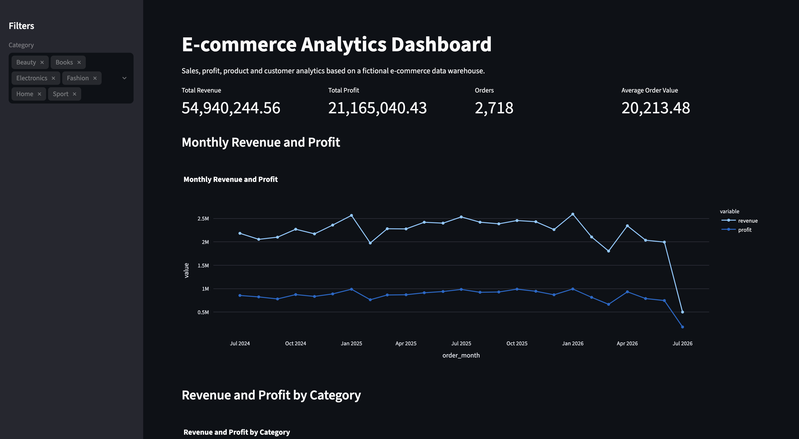

# E-commerce Data Warehouse

This project demonstrates an end-to-end analytics workflow for a fictional e-commerce business. It includes data generation in Python, loading data into a MySQL database, analytical SQL queries, a reporting view and a Streamlit dashboard.

## Features

- Python script for generating realistic fictional e-commerce data
- MySQL relational database schema
- ETL script for loading CSV data into MySQL
- Analytical SQL queries for revenue, profit, customers, products and returns
- `sales_fact` SQL view for reporting
- Streamlit dashboard with KPIs, filters and charts

## Dashboard Preview



## Technologies

- Python
- pandas
- Faker
- MySQL
- SQLAlchemy
- PyMySQL
- Streamlit
- Plotly

## Project Structure

```text
app/
  dashboard.py

assets/
  dashboard_overview.png

data/
  raw/

sql/
  create_tables.sql
  analytical_queries.sql
  views.sql

src/
  generate_data.py
  load_to_mysql.py
```

## How to Run

1. Clone the repository:

```bash
git clone https://github.com/MaxKubic/ecommerce-data-warehouse.git
cd ecommerce-data-warehouse
```

2. Create and activate a virtual environment:

```bash
python3 -m venv .venv
source .venv/bin/activate
```

3. Install dependencies:

```bash
pip install -r requirements.txt
```

4. Create a `.env` file in the project root:

```env
DB_USER=root
DB_PASSWORD=your_mysql_password
DB_HOST=localhost
DB_PORT=3306
DB_NAME=Warehouse
```

5. Create the MySQL database and tables using:

```text
sql/create_tables.sql
```

6. Generate sample data:

```bash
python src/generate_data.py
```

7. Load data into MySQL:

```bash
python src/load_to_mysql.py
```

8. Run the dashboard:

```bash
streamlit run app/dashboard.py
```

## Key Insights

- The fictional e-commerce store generated total revenue of approximately 54.9M and total profit of approximately 21.1M.
- The dashboard allows filtering by product category.
- Monthly revenue and profit trends are visualized using a Streamlit dashboard.
- The `sales_fact` view simplifies reporting by combining orders, order items and product data into one analytical layer.

## What This Project Demonstrates

- Relational database design with primary and foreign keys
- Data generation and transformation in Python
- Loading structured CSV data into MySQL
- Analytical SQL queries using joins, aggregations and subqueries
- Creation of SQL views for reporting
- Building an interactive dashboard with Streamlit and Plotly
- Basic project structure, environment configuration and Git version control
